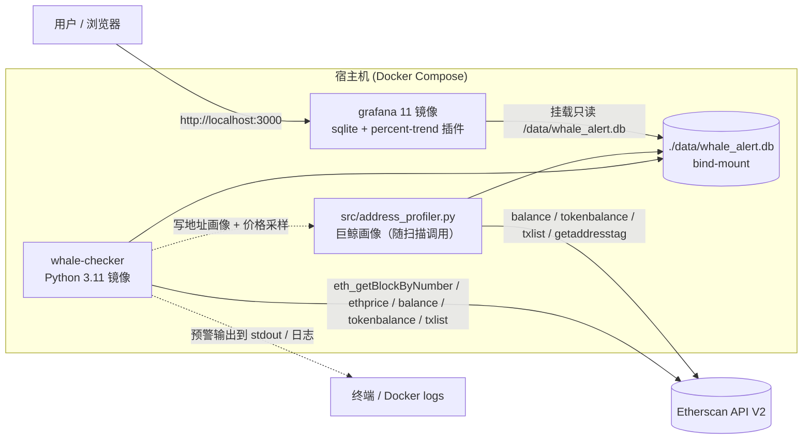
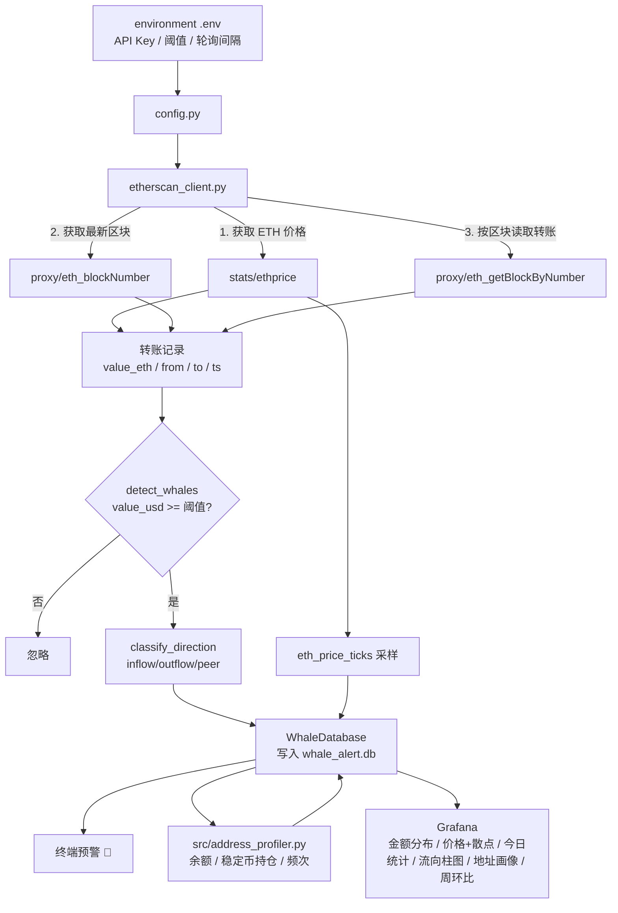

# 🐋 链上巨鲸行为预警系统 (On-chain Whale Behaviour Alert System)

[中文](README.md) | [English](README_en.md)

准实时（定时轮询）监控以太坊主网的大额 ETH 转账。当一笔转账的美元价值超过阈值时，系统把该“巨鲸交易”写入 SQLite，并在终端打印预警；同时通过 **Docker Compose** 编排 Grafana，用预制看板可视化近 24 小时的巨鲸活动。

- **数据源**：Etherscan API V2（免费 tier，通过 `proxy/eth_getBlockByNumber` 读取区块内 ETH 转账）
- **阈值**：`WHALE_THRESHOLD_USD`（默认 `500000`，即 50 万美元，较初版 $10M 下调以捕获更多巨鲸）——从 `environment .env` 读取
- **存储**：SQLite（`data/whale_alert.db`，含 `whale_transfers` / `address_profiles` / `eth_price_ticks`）
- **可视化**：Grafana 11 + `frser-sqlite-datasource` + `nikosc-percenttrend-panel`，provisioning 自动加载
- [**在线公开静态快照（无需本地运行即可查看）**](http://localhost:3000/dashboard/snapshot/GXcEjoseCUqtEZMv4TkGAxQ9YhwHnFeO)
- [**在线公开动态看板（无需本地运行即可查看）**](https://snapshots.raintank.io/dashboard/snapshot/YWCQi1i0cFvSQ2rOdIJi7lhtT9eR4oGC)

---

## ✨ 主要特性

| 模块 | 说明 |
| --- | --- |
| `whale_alert.py` | 主入口：轮询 Etherscan，检测巨鲸，写入数据库并打印预警 |
| `etherscan_client.py` | Etherscan V2 客户端 + 纯函数 `detect_whales` / `classify_direction` |
| `database.py` | SQLite 建表 / 去重写入 / 地址画像与价格采样（WAL 模式） |
| `backfill.py` | 历史回填工具：**startblock/endblock 自动分页**（offset=1000/页）+ 地址画像 |
| `src/address_profiler.py` | 巨鲸地址画像：余额 / USDT-USDC-DAI 持仓 / 交易频次 / 合约探测等 |
| `Dockerfile` / `docker-compose.yml` | Python 检查器 + Grafana 编排 |
| `grafana/` | Provisioning：SQLite 数据源 + 基础看板模板 |
| `tests/` | pytest 单测，覆盖 `detect_whales` |

> ⚡ **本次优化（v2）**：①阈值默认下调至 `$500,000`；②`backfill.py` 支持 `startblock/endblock + offset` 自动分页；
> ③新增 `src/address_profiler.py` 巨鲸地址画像（ETH 余额 / USDT-USDC-DAI 持仓 / 交易频次 / 合约探测 / 近活跃时间等）并写入 `address_profiles` 表；
> ④新增 `eth_price_ticks` 价格采样表；⑤Grafana 看板扩展到 8 个面板（价格+散点、今日统计、流向柱图、地址画像、周环比）。详见 [docs/development-log.md](docs/development-log.md)。

---

## 🏗️ 架构图



---

## 🔄 数据流图



---

## 📦 环境准备

项目使用 conda 虚拟环境 `whale_alert_project`（Python 3.11，已存在）。

```bash
# 1) 创建并激活环境（所有命令都需要）
conda create -n whale_alert_project python=3.11
conda activate whale_alert_project

# 2) 安装依赖（在项目根目录执行）
cd whale-alert-system        # 或： cd /path/to/whale-alert-system
pip install -r requirements.txt

# 3) 安装Docker和Grafana服务
```

### 配置文件 `environment .env`

把真实值填到项目根目录的 `environment .env`（已被 `.gitignore` 忽略，不入库）：

```ini
ETHERSCAN_API_KEY=你的Etherscan V2 API Key
WHALE_THRESHOLD_USD=500000
POLL_INTERVAL_SECONDS=60
SCAN_BLOCK_WINDOW=20
CHAIN_ID=1
```

- `ETHERSCAN_API_KEY`：在 [etherscan.io](https://etherscan.io/apis) 创建。
- `WHALE_THRESHOLD_USD`：巨鲸判定阈值（美元），**默认 50 万**（`config.py` 兜底值；若 `environment .env` 显式赋值则以此为准）。
- `SCAN_BLOCK_WINDOW`：每次轮询扫描的最新区块数（每个区块 = 一次 API 请求，受免费额度限制，默认 20）。

> 参考模板见 [`.env.example`](./.env.example)。

---

## 🚀 运行

### 方式一：本地运行

```bash
# 单次扫描（测试用 / 定时任务）
python whale_alert.py --once

# 持续轮询（默认每 60s 一次）
python whale_alert.py

# 历史数据回填（自动分页：startblock..endblock，每页 offset=1000 区块）
python backfill.py --blocks 1500 --offset 1000

# 只回填、不做地址画像
python backfill.py --blocks 1000 --no-profile

# 巨鲸地址画像（独立运行，或由扫描/回填自动触发）
python -m src.address_profiler            # 增量画像
python -m src.address_profiler --force    # 全量重画像
```

### 方式二：Docker Compose（推荐）

```bash
git clone <repo>

cd whale-alert-system        # 或： cd /path/to/whale-alert-system

# 构建并启动docker容器，此时容器会自动运行轮询+回填数据
docker compose up -d --build

# 查看巨鲸预警日志
docker compose logs -f whale-checker
```

启动后访问 Grafana：**http://localhost:3000**

- 登录：默认 `admin` / `admin`
- 数据源与看板由 provisioning 自动加载，无需手动配置。
- **开箱即用（一键全自动）**：首次启动时 `docker-entrypoint.sh` 会先把仓库内置的快照数据（`seed/whale_alert.db`）灌入运行库，因此**哪怕还没配置 API Key，也能立刻看到有数据的看板**；随后自动回填最新 **2000 个区块**（`BOOTSTRAP_BLOCKS`，可用 `FORCE_BACKFILL=1` 重跑）并进入持续轮询。想要「持续更新」的实时数据，只需在 `environment .env` 里提供 `ETHERSCAN_API_KEY`。

> **插件说明**：需求中的 “Percentage Trend” 面板使用官方社区插件（Grafana Labs），其可安装 id 为
> `nikosc-percenttrend-panel`（`grafana-percentage-trend-panel` 是显示名，非实际插件 id）。
> `docker-compose.yml` 中已同时设置 `GF_INSTALL_PLUGINS`（运行时安装）与 `GF_PLUGINS_PREINSTALL`。

---

## 🕵️ 预期效果

终端预警示例：

```applescript
====================================================================
  🐋  3 笔巨鲸交易触发（阈值 ≥ $10,000,000 USD）
====================================================================
  [exchange_inflow] 4,850.00 ETH ≈ $13,012,000.00 USD
    from: 0xabc...
    to:   0x28c6c0...  (Binance)
    hash: 0x7f...
====================================================================
```

Grafana 看板（`whale-overview`）共 8 个面板：

1. **最近 24 小时巨鲸交易金额分布**（按小时柱状图，USD）
2. **按交易所流向占比**（饼图：流入 / 流出 / 点对点）
3. **巨鲸活动时间线**（明细表）
4. **ETH 价格曲线 + 巨鲸交易金额散点**（Timeseries，对数轴；价格源自 `eth_price_ticks` 采样）
5. **今日巨鲸交易统计**（Stat：今日笔数 / 总额 / 单笔最大）
6. **按交易所流向的金额分布**（Bar Chart）
7. **巨鲸地址画像**（Table：余额 / 稳定币 / 交易频次 / 合约探测 / ETH 敞口）
8. **本周 vs 上周巨鲸交易金额环比**（Percentage Trend）


---

## ⏱️ 关于「实时」与数据覆盖范围

本系统采用**准实时轮询架构（定时轮询 Polling）**，而不是实时流式推送（Streaming）；轮询间隔由 `.env` 中的 `POLL_INTERVAL_SECONDS` 控制。它通过可配置的轮询间隔持续从 Etherscan 拉取最新区块数据，写入 SQLite 供 Grafana 展示。**它不是真正的流式实时**（比如 WebSocket 订阅 `newHeads`），因为 Etherscan 免费 API 不提供 WebSocket 推送；但把轮询间隔缩短到 10–15 秒即可达到近似实时的监控效果。之所以选择该方案，是因为 Etherscan 免费 API 的限制——通过 Alchemy 或 Infura 的 WebSocket 订阅 `newHeads` 需要付费节点。

当前数据库中的巨鲸交易记录覆盖最近约 **7,200 个区块（约 24 小时）**的链上数据。回填范围可通过 `backfill.py --blocks N` 参数调整；若需覆盖更长时间窗口，建议结合 `startblock` 和 `endblock` 参数按需回填，并注意 Etherscan 免费 API 的每日调用限额（10 万次/天）。如果想让覆盖时间更长，只需修改 `backfill.py` 的区块范围，比如 `--blocks 10000` 就是大约 33 小时。

---

## 🧪 测试

```bash
conda activate whale_alert_project
python -m pytest -q
```

覆盖 `detect_whales` 的阈值判定、边界值、方向分类与输入不被修改等用例。

---

## 📁 目录结构

```
.
├── whale_alert.py            # 主入口（轮询 + 预警）
├── etherscan_client.py       # Etherscan V2 客户端 + detect_whales
├── database.py               # SQLite 存取
├── config.py                 # 配置加载（读 environment .env）
├── backfill.py               # 历史回填（auto-pagination, offset=1000/页）
├── src/address_profiler.py   # 巨鲸地址画像（余额/稳定币/频次/合约）
├── src/__init__.py
├── requirements.txt
├── Dockerfile
├── docker-compose.yml
├── .env.example              # 环境变量模板（真实值在 environment .env）
├── environment .env          # 真实密钥/阈值（已 gitignore，不入库）
├── data/whale_alert.db       # SQLite 数据库（运行生成）
├── grafana/
│   ├── provisioning/
│   │   ├── datasources/whale_datastore.yaml
│   │   └── dashboards/whale_dashboards.yaml
│   └── dashboards/whale_dashboard.json
├── tests/test_whale_alert.py
└── docs/development-log.md   # 开发日志 + 看板 insights
```

---

## ⚠️ 注意事项

- **免费 API 额度**：Etherscan 免费 tier 约 5 请求/秒、10 万请求/天。`SCAN_BLOCK_WINDOW` 每次轮询会消耗该值个请求，长时间高频轮询前请核算预算。
- **内部交易（合约间转账）**：本项目基于 `eth_getBlockByNumber` 读取对外可见的 VALUE 转账，主要覆盖“以太坊本币转账”。若需追踪合约内部 ETH 流转，需升级 Etherscan API Pro（`txlistinternal`）。
- **交易所地址清单**：有限的内置地址集（Binance/Coinbase/Kraken），用于流向分类，可按需扩充 `EXCHANGE_ADDRESSES`。
- **时区**：看板使用浏览器时区，DB 内存储 unix 时间戳。

---

## 📄 文档

- [开发日志 + 数据洞察](docs/development-log.md)

