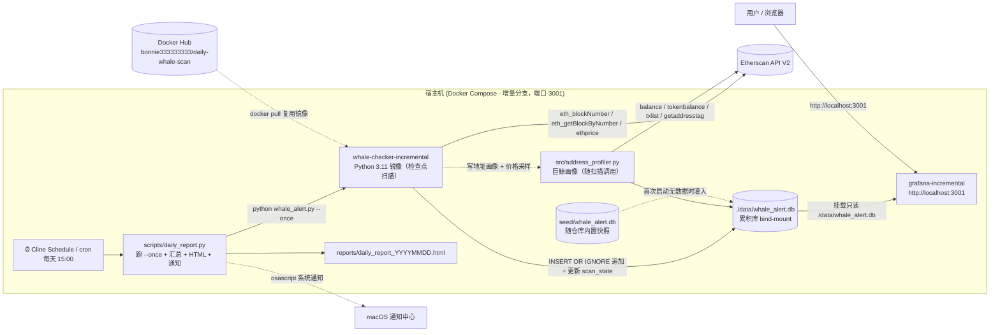
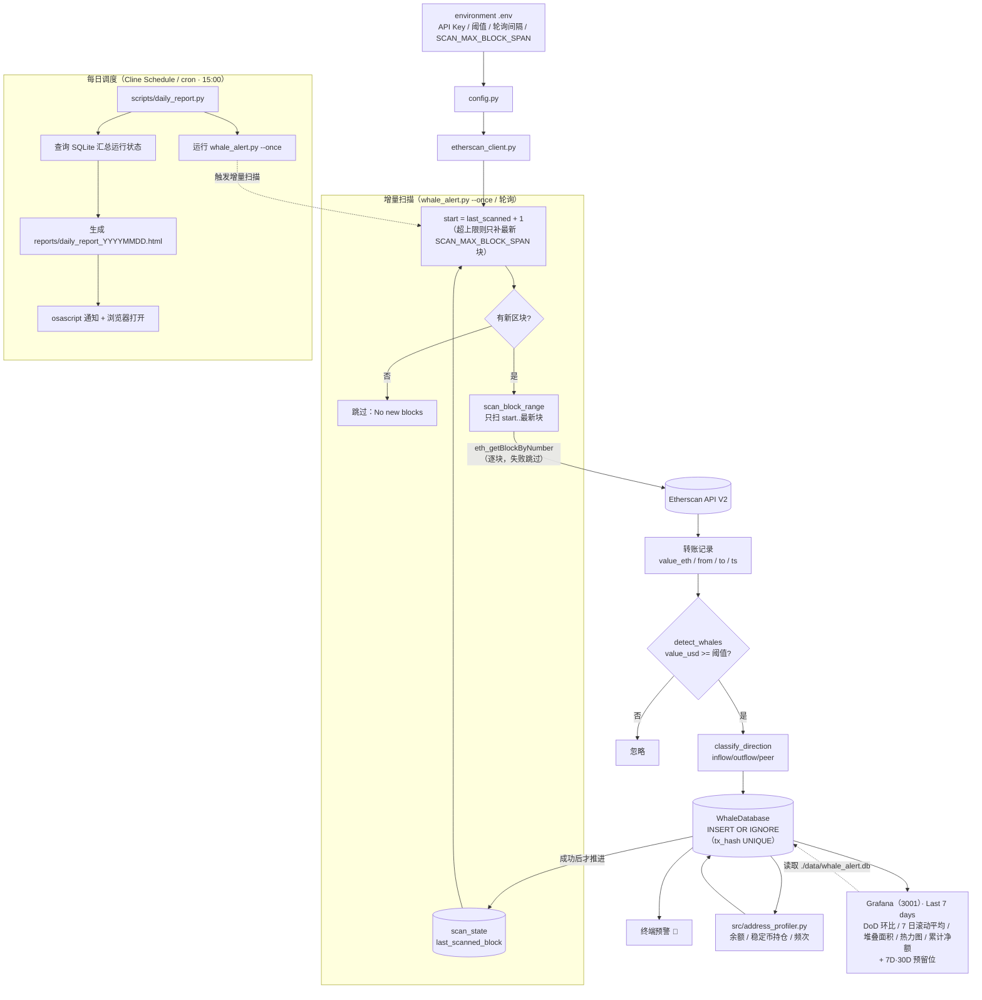

# 🐋 链上巨鲸行为预警系统·数据资产化 (On-chain Whale Behaviour Alert System·Data Assetization)

[中文](README.md) | [English](README_en.md)

准实时（定时轮询）监控以太坊主网的大额 ETH 转账。当一笔转账的美元价值超过阈值时，系统把该“巨鲸交易”写入 SQLite，并在终端打印预警；同时通过 **Docker Compose** 编排 Grafana，用预制看板可视化近 24 小时的巨鲸活动。

- **数据源**：Etherscan API V2（免费 tier，通过 `proxy/eth_getBlockByNumber` 读取区块内 ETH 转账）
- **阈值**：`WHALE_THRESHOLD_USD`（默认 `500000`，即 50 万美元，较初版 $10M 下调以捕获更多巨鲸）——从 `environment .env` 读取
- **存储**：SQLite（`data/whale_alert.db`，含 `whale_transfers` / `address_profiles` / `eth_price_ticks`）
- **可视化**：Grafana 11 + `frser-sqlite-datasource` + `nikosc-percenttrend-panel`，provisioning 自动加载
- [**在线公开动态快照（无需本地运行即可查看）**](http://localhost:3000/public-dashboards/5483435ec6e64ceea4d9a573aeb0249d)
- [**在线公开静态看板（无需本地运行即可查看）**](https://snapshots.raintank.io/dashboard/snapshot/CoPRoFJML8wuDB0bKRBrEBZpFAT6zp81)

> 💡 **如需了解增量累积与数据资产化设计，请查看 `feature/incremental-pipeline` 分支。**

---

## 🌿 增量累积模式（feature/incremental-pipeline）

本项目支持**增量累积模式**，通过 **cron 每日调度持续更新**：

- **只拉新数据**：每次扫描**只拉取上次扫描区块之后的新数据**，基于 `tx_hash` 去重后**追加**到 `whale_transfers` 表
  （列级 `tx_hash UNIQUE` 约束 + `INSERT OR IGNORE`，幂等可重放）。
- **断点续扫**：扫描进度由 `scan_state.last_scanned_block` 记录，重启或漏跑后自动从上次位置续扫
  （`SCAN_MAX_BLOCK_SPAN` 防止一次补太多）。
- **每日调度**：可通过 **cron** 或 **Cline Schedule** 每日调度，**持续积累数据资产**。
- **内置历史数据**：仓库中的 `data/whale_alert.db` 已包含通过 `backfill.py` 回填的**历史数据**，
  用于展示**多日时间序列分析**效果。若要持续更新，请配置每日调度任务（见下）。

### 🚀 运行

```bash
# 1) 克隆增量分支
git clone -b feature/incremental-pipeline \
  ssh://git@ssh.github.com:443/DingBangBang/whale-alert-system.git \
  whale-alert-system-incremental
cd whale-alert-system-incremental

# 2) 激活 conda 环境并安装依赖
conda activate whale_alert_project      # Python 3.11；没有就先 conda create -n whale_alert_project python=3.11
pip install -r requirements.txt
# 把 ETHERSCAN_API_KEY 写入 environment .env（参考 .env.example）

# 3) 配置每日调度（二选一）
# 3a) Cline Schedule（推荐，先创建一次）
cline schedule create "daily-whale-scan" \
  --cron "0 15 * * *" \
  --prompt "conda activate whale_alert_project && python whale_alert.py --once" \
  --workspace ~/Desktop/whale-alert-system-incremental

# 3b) 或系统 cron（每天 15:00）
# 0 15 * * * cd ~/Desktop/whale-alert-system-incremental && \
#   conda run -n whale_alert_project python whale_alert.py --once >> logs/cron.log 2>&1

# 4) 数据会自动增量写入 data/whale_alert.db，Grafana 看板随之刷新
```

### 🐳 拉取Docker镜像

如果你不想自己 build 但又想拥有这个项目，可以直接拉取镜像：

```bash
docker pull bonnie333333333/daily-whale-scan:latest

# 单次增量扫描（挂载宿主 ./data，密钥用 -e 注入）
docker run --rm -v "$PWD/data:/app/data:rw" \
  -e ETHERSCAN_API_KEY=你的Key \
  bonnie333333333/daily-whale-scan:latest python whale_alert.py --once
```
<!----
### 📦 本地构建并推送（维护者）

```bash
docker build -t bonnie333333333/daily-whale-scan:latest .
docker push bonnie333333333/daily-whale-scan:latest
```
---->
---

## Demo Data & Dashboard (7d / 30d)

<!--
  待 30 天累积数据生成后补充数据库文件与看板截图。
  计划在此处补充：
  - 30 天累积的 data/whale_alert.db（或压缩包）与下载说明
  - Last 7 days / Last 30 days 时间序列看板截图
  - 数据覆盖区间、总记录数、巨鲸笔数等统计
-->

> ⏳ 待 30 天累积数据生成后补充数据库文件与看板截图。

---

## 📈 时间序列分析

看板在原有 8 个面板基础上，新增以下 **5 个时间序列 Panel**（默认时间范围 **Last 7 days**），用于把「累积数据」变成可读的趋势：

| Panel | 类型 | 计算逻辑（SQL 摘要） | 业务含义 |
| --- | --- | --- | --- |
| **DoD 环比**（每日巨鲸金额 + 日环比%） | timeseries | 按天 `SUM(value_usd)`，并用相关子查询取「前一天总额」算 `(今日-昨日)/昨日×100%` | 看单日相对前一日的**变化速度**，判断巨鲸活动升温还是降温 |
| **7 日滚动平均** | timeseries | 按天汇总后，对每天取「当天及前 6 天」的 `AVG(total)` | 抹平单日噪声，识别**真实趋势**（而非被某天巨鲸暴击带偏） |
| **堆叠面积**（每日流向金额构成） | timeseries | 按天 `GROUP BY`，用 `CASE WHEN direction=...` 拆成「交易所流入 / 流出 / 点对点」三条序列并堆叠 | 看资金**结构变化**：是入所（潜在抛压）还是点对点转移 |
| **热力图**（巨鲸交易金额密度） | heatmap | 每条记录 `(timestamp, value_usd)`，交给 Grafana 按时间/金额自动分桶 | 快速定位**大额集中时段**、识别金额分布密度 |
| **累计净额**（交易所累计净流入） | timeseries | 对每个时间点用相关子查询累加 `流入(+)/流出(-)` | 衡量区间内的**净抛压 / 承接**方向与强度 |

> 具体 SQL 与逐条计算逻辑见 [docs/development-log.md](docs/development-log.md) 第七章。

---

## 🔔 每日运行反馈

每次定时任务（`python scripts/daily_report.py`）完成后：

- **生成 HTML 报告**到 `reports/daily_report_YYYYMMDD.html`；
- **弹出 macOS 系统通知**（`osascript`），例如「新增 X 条，总记录 Y 条」；任务失败时也会弹
  「今日运行失败：<原因>」而不会静默消失；
- 成功后在浏览器中**自动打开**当天的 HTML 报告。

报告包含字段：运行状态、链上拉取状态、累积表写入状态、Grafana 刷新状态、运行时长、
**本次新增条数**、**最新记录时间戳**、**总记录数**、`last_scanned_block`，以及 Grafana 链接
（http://localhost:3001）。详见 [scripts/daily_report.py](scripts/daily_report.py)。

---

## ✨ 主要特性

| 模块 | 说明 |
| --- | --- |
| `whale_alert.py` | 主入口：轮询 Etherscan，检测巨鲸，写入数据库并打印预警 |
| `etherscan_client.py` | Etherscan V2 客户端 + 纯函数 `detect_whales` / `classify_direction` |
| `database.py` | SQLite 建表 / 去重写入 / 地址画像与价格采样（WAL 模式） |
| `backfill.py` | 历史回填工具：**startblock/endblock 自动分页**（offset=1000/页）+ 地址画像 |
| `src/address_profiler.py` | 巨鲸地址画像：余额 / USDT-USDC-DAI 持仓 / 交易频次 / 合约探测等 |
| `Dockerfile` / `docker-compose.yml` | Python 检查器 + Grafana 编排 |
| `grafana/` | Provisioning：SQLite 数据源 + 基础看板模板 |
| `tests/` | pytest 单测，覆盖 `detect_whales` |

> ⚡ **本次优化（v2）**：①阈值默认下调至 `$500,000`；②`backfill.py` 支持 `startblock/endblock + offset` 自动分页；
> ③新增 `src/address_profiler.py` 巨鲸地址画像（ETH 余额 / USDT-USDC-DAI 持仓 / 交易频次 / 合约探测 / 近活跃时间等）并写入 `address_profiles` 表；
> ④新增 `eth_price_ticks` 价格采样表；⑤Grafana 看板扩展到 8 个面板（价格+散点、今日统计、流向柱图、地址画像、周环比）。详见 [docs/development-log.md](docs/development-log.md)。

---

## 🏗️ 架构图（增量分支）

> 增量分支与主分支**并存**：主分支 Grafana 占 **3000**，本分支占 **3001**。下图为本分支的组件与新增能力。



---

## 🔄 数据流图（增量累积）


<!----
---

## 📁 目录结构

```
.
├── whale_alert.py            # 主入口（轮询 + 预警）
├── etherscan_client.py       # Etherscan V2 客户端 + detect_whales
├── database.py               # SQLite 存取
├── config.py                 # 配置加载（读 environment .env）
├── backfill.py               # 历史回填（auto-pagination, offset=1000/页）
├── src/address_profiler.py   # 巨鲸地址画像（余额/稳定币/频次/合约）
├── src/__init__.py
├── requirements.txt
├── Dockerfile
├── docker-compose.yml
├── .env.example              # 环境变量模板（真实值在 environment .env）
├── environment .env          # 真实密钥/阈值（已 gitignore，不入库）
├── data/whale_alert.db       # SQLite 数据库（运行生成）
├── grafana/
│   ├── provisioning/
│   │   ├── datasources/whale_datastore.yaml
│   │   └── dashboards/whale_dashboards.yaml
│   └── dashboards/whale_dashboard.json
├── tests/test_whale_alert.py
└── docs/development-log.md   # 开发日志 + 看板 insights
```
----->
---

## 📄 文档

- [开发日志 + 数据洞察](docs/development-log.md)

