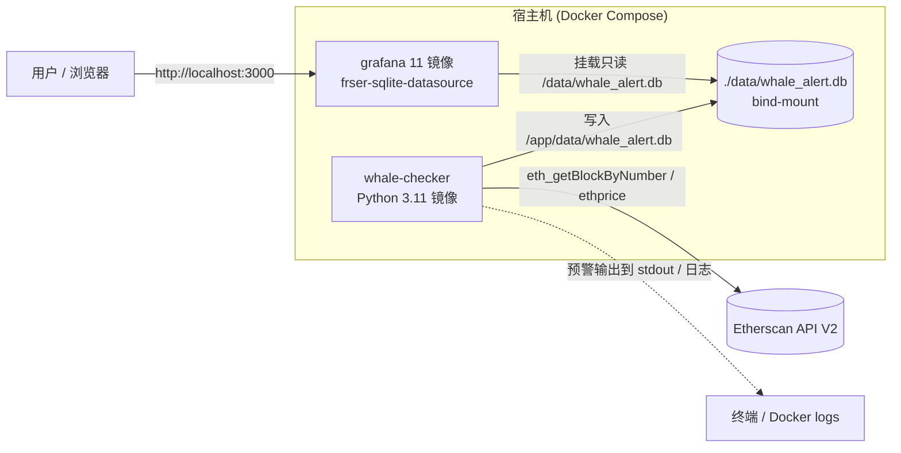
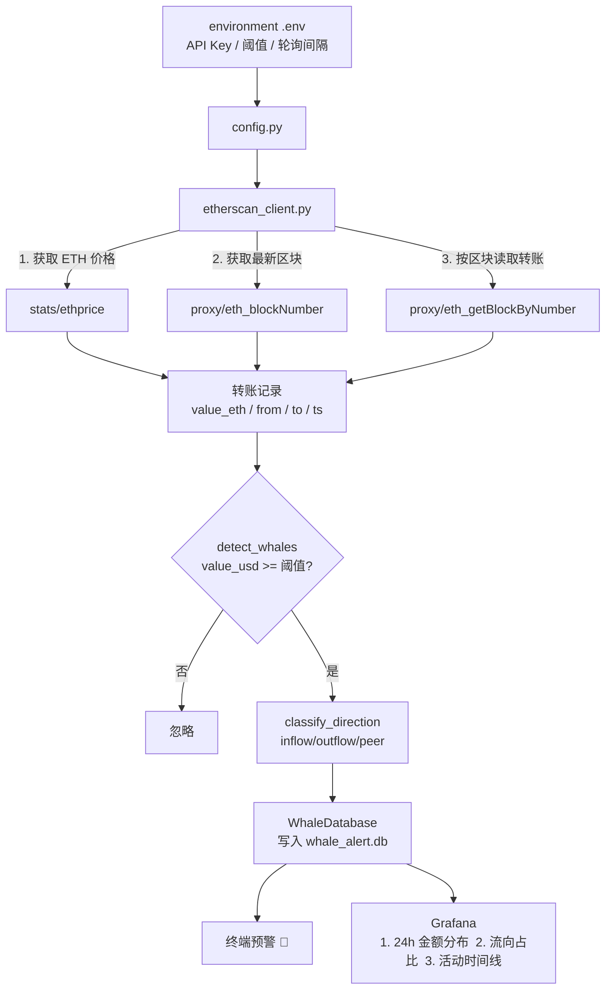

# 🐋 链上巨鲸行为预警系统 (On-chain Whale Behaviour Alert System)

实时监控以太坊主网的大额 ETH 转账。当一笔转账的美元价值超过阈值时，系统把该“巨鲸交易”写入 SQLite，并在终端打印预警；同时通过 **Docker Compose** 编排 Grafana，用预制看板可视化近 24 小时的巨鲸活动。

- **数据源**：Etherscan API V2（免费 tier，通过 `proxy/eth_getBlockByNumber` 读取区块内 ETH 转账）
- **阈值**：`WHALE_THRESHOLD_USD`（默认 `10000000`，即 1000 万美元）——从 `environment .env` 读取
- **存储**：SQLite（`data/whale_alert.db`）
- **可视化**：Grafana 11 + `frser-sqlite-datasource` 插件，provisioning 自动加载

---

## ✨ 主要特性

| 模块 | 说明 |
| --- | --- |
| `whale_alert.py` | 主入口：轮询 Etherscan，检测巨鲸，写入数据库并打印预警 |
| `etherscan_client.py` | Etherscan V2 客户端 + 纯函数 `detect_whales` / `classify_direction` |
| `database.py` | SQLite 建表 / 去重写入 / 查询（WAL 模式） |
| `backfill.py` | 历史数据回填工具（并发扫描，用于快速填充看板） |
| `Dockerfile` / `docker-compose.yml` | Python 检查器 + Grafana 编排 |
| `grafana/` | Provisioning：SQLite 数据源 + 基础看板模板 |
| `tests/` | pytest 单测，覆盖 `detect_whales` |

---

## 🏗️ 架构图



---

## 🔄 数据流图



---

## 📦 环境准备

项目使用 conda 虚拟环境 `whale_alert_project`（Python 3.11，已存在）。

```bash
# 1) 激活环境（所有命令都需要）
conda activate whale_alert_project

# 2) 安装依赖
cd /Users/dingbangchu/Desktop/whale-alert-system
pip install -r requirements.txt
```

### 配置文件 `environment .env`

把真实值填到项目根目录的 `environment .env`（已被 `.gitignore` 忽略，不入库）：

```ini
ETHERSCAN_API_KEY=你的Etherscan V2 API Key
WHALE_THRESHOLD_USD=10000000
POLL_INTERVAL_SECONDS=60
SCAN_BLOCK_WINDOW=20
CHAIN_ID=1
```

- `ETHERSCAN_API_KEY`：在 [etherscan.io](https://etherscan.io/apis) 创建。
- `WHALE_THRESHOLD_USD`：巨鲸判定阈值（美元），默认 1000 万。
- `SCAN_BLOCK_WINDOW`：每次轮询扫描的最新区块数（每个区块 = 一次 API 请求，受免费额度限制，默认 20）。

> 参考模板见 [`.env.example`](./.env.example)。

---

## 🚀 运行

### 方式一：本地运行

```bash
conda activate whale_alert_project

# 单次扫描（测试用 / 定时任务）
python whale_alert.py --once

# 持续轮询（默认每 60s 一次）
python whale_alert.py

# 历史数据回填（快速填充看板，例如最近 1500 个区块）
python backfill.py --blocks 1500
```

### 方式二：Docker Compose（推荐）

```bash
cd /Users/dingbangchu/Desktop/whale-alert-system

# 构建并启动（whale-checker + grafana）
docker compose up -d --build

# 查看巨鲸预警日志
docker compose logs -f whale-checker

# 停止
docker compose down
```

启动后访问 Grafana：**http://localhost:3000**

- 登录：默认 `admin` / `admin`
- 数据源与看板由 provisioning 自动加载，无需手动配置。

---

## 🕵️ 预期效果

终端预警示例：

```
====================================================================
  🐋  3 笔巨鲸交易触发（阈值 ≥ $10,000,000 USD）
====================================================================
  [exchange_inflow] 4,850.00 ETH ≈ $13,012,000.00 USD
    from: 0xabc...
    to:   0x28c6c0...  (Binance)
    hash: 0x7f...
====================================================================
```

Grafana 看板（`whale-overview`）三个面板：

1. **最近 24 小时巨鲸交易金额分布**（按小时柱状图，USD）
2. **按交易所流向占比**（饼图：流入 / 流出 / 点对点）
3. **巨鲸活动时间线**（明细表）

---

## 🧪 测试

```bash
conda activate whale_alert_project
python -m pytest -q
```

覆盖 `detect_whales` 的阈值判定、边界值、方向分类与输入不被修改等用例。

---

## 📁 目录结构

```
.
├── whale_alert.py            # 主入口（轮询 + 预警）
├── etherscan_client.py       # Etherscan V2 客户端 + detect_whales
├── database.py               # SQLite 存取
├── config.py                 # 配置加载（读 environment .env）
├── backfill.py               # 历史回填工具
├── requirements.txt
├── Dockerfile
├── docker-compose.yml
├── .env.example              # 环境变量模板（真实值在 environment .env）
├── environment .env          # 真实密钥/阈值（已 gitignore，不入库）
├── data/whale_alert.db       # SQLite 数据库（运行生成）
├── grafana/
│   ├── provisioning/
│   │   ├── datasources/whale_datastore.yaml
│   │   └── dashboards/whale_dashboards.yaml
│   └── dashboards/whale_dashboard.json
├── tests/test_whale_alert.py
└── docs/development-log.md   # 开发日志 + 看板 insights
```

---

## ⚠️ 注意事项

- **免费 API 额度**：Etherscan 免费 tier 约 5 请求/秒、10 万请求/天。`SCAN_BLOCK_WINDOW` 每次轮询会消耗该值个请求，长时间高频轮询前请核算预算。
- **内部交易（合约间转账）**：本项目基于 `eth_getBlockByNumber` 读取对外可见的 VALUE 转账，主要覆盖“以太坊本币转账”。若需追踪合约内部 ETH 流转，需升级 Etherscan API Pro（`txlistinternal`）。
- **交易所地址清单**：有限的内置地址集（Binance/Coinbase/Kraken），用于流向分类，可按需扩充 `EXCHANGE_ADDRESSES`。
- **时区**：看板使用浏览器时区，DB 内存储 unix 时间戳。

---

## 📄 文档

- [开发日志 + 数据洞察](docs/development-log.md)

## 许可证

MIT（本项目为教学/演示用途，不构成投资建议）。