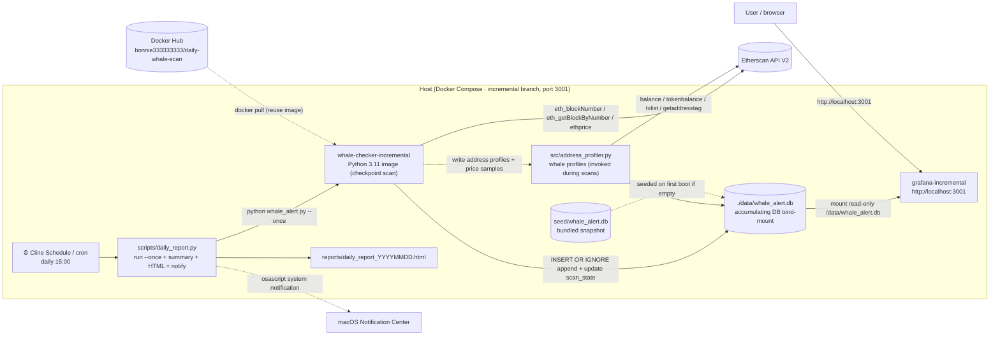
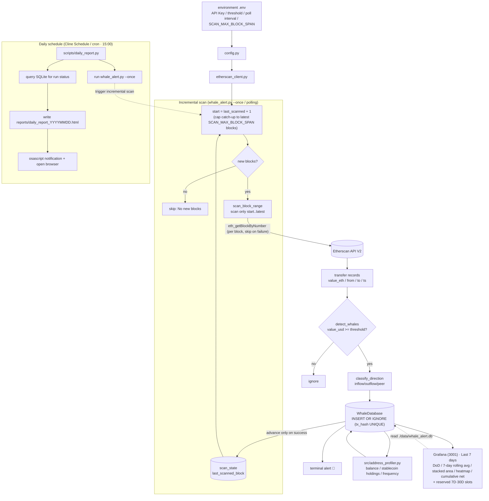

# 🐋 On-Chain Whale Activity Monitoring & Alert System · Data Assetization

[中文](README.md) | [English](README_en.md)

Near-real-time (scheduled polling) monitoring of large ETH transfers on Ethereum mainnet. When a transfer's USD value exceeds the threshold, the system writes that "whale transaction" into SQLite and prints an alert to the terminal; at the same time **Docker Compose** orchestrates Grafana with a pre-built dashboard that visualises whale activity from the last 24 hours.

- **Data source**: Etherscan API V2 (free tier, reads in-block ETH transfers via `proxy/eth_getBlockByNumber`)
- **Threshold**: `WHALE_THRESHOLD_USD` (default `500000`, i.e. $500K — lowered from the initial $10M to capture more whales) — read from `environment .env`
- **Storage**: SQLite (`data/whale_alert.db`, tables `whale_transfers` / `address_profiles` / `eth_price_ticks`)
- **Visualisation**: Grafana 11 + `frser-sqlite-datasource` + `nikosc-percenttrend-panel`, auto-loaded via provisioning
- [**Online public static snapshot (view without running locally)**](http://localhost:3000/dashboard/snapshot/GXcEjoseCUqtEZMv4TkGAxQ9YhwHnFeO)
- [**Online public live dashboard (view without running locally)**](https://snapshots.raintank.io/dashboard/snapshot/YWCQi1i0cFvSQ2rOdIJi7lhtT9eR4oGC)

> 💡 **For the incremental accumulation and data-asset design, see the `feature/incremental-pipeline` branch.**

---

## 🌿 Incremental accumulation mode (feature/incremental-pipeline)

This project supports an **incremental accumulation mode**, kept up to date by a **daily cron schedule**:

- **Only new data**: each scan **only pulls blocks newer than the last scanned one**, dedups by `tx_hash` and **appends** to the `whale_transfers` table (column-level `tx_hash UNIQUE` + `INSERT OR IGNORE`, idempotent and replayable).
- **Resumable**: the scan progress is stored in `scan_state.last_scanned_block`, so after a restart or a missed run it resumes from the last position (`SCAN_MAX_BLOCK_SPAN` caps a single catch-up).
- **Daily scheduling**: schedule it daily via **cron** or **Cline Schedule** to **keep accumulating a data asset**.
- **Bundled history**: the repository's `data/whale_alert.db` already contains **historical data** backfilled via `backfill.py`, used to demonstrate **multi-day time-series analysis**. To keep it updating, configure a daily job (below).

### 🚀 Running

```bash
# 1) Clone the incremental branch
git clone -b feature/incremental-pipeline \
  ssh://git@ssh.github.com:443/DingBangBang/whale-alert-system.git \
  whale-alert-system-incremental
cd whale-alert-system-incremental

# 2) Activate the conda env and install dependencies
conda activate whale_alert_project      # Python 3.11; create first if needed: conda create -n whale_alert_project python=3.11
pip install -r requirements.txt
# Put ETHERSCAN_API_KEY into environment .env (see .env.example)

# 3) Configure the daily schedule (either option)
# 3a) Cline Schedule (recommended)
cline schedule create "daily-whale-scan" \
  --cron "0 15 * * *" \
  --prompt "conda activate whale_alert_project && python whale_alert.py --once" \
  --workspace ~/Desktop/whale-alert-system-incremental

# 3b) Or system cron (daily at 15:00)
# 0 15 * * * cd ~/Desktop/whale-alert-system-incremental && \
#   conda run -n whale_alert_project python whale_alert.py --once >> logs/cron.log 2>&1

# 4) Data is appended incrementally into data/whale_alert.db; the Grafana dashboard refreshes with it
```

### 🐳 Pull the image directly (no build needed)

If you don't want to build it yourself but still want the project, just pull the image:

```bash
docker pull bonnie333333333/daily-whale-scan:latest

# One incremental scan (mount host ./data, inject the key with -e)
docker run --rm -v "$PWD/data:/app/data:rw" \
  -e ETHERSCAN_API_KEY=your_key \
  bonnie333333333/daily-whale-scan:latest python whale_alert.py --once
```
<!----
### 📦 Build & push locally (maintainer)

```bash
docker build -t bonnie333333333/daily-whale-scan:latest .
docker push bonnie333333333/daily-whale-scan:latest
```
----->
---

## Demo Data & Dashboard (7d / 30d)

<!--
  To be filled once the 30-day accumulated data is generated.
  Planned content:
  - the 30-day accumulated data/whale_alert.db (or an archive) with download notes
  - Last 7 days / Last 30 days time-series dashboard screenshots
  - coverage window, total record count, whale count, etc.
-->

> ⏳ To be filled once the 30-day accumulated data is generated (DB file + dashboard screenshots).

---

## 📈 Time-series analysis

On top of the original 8 panels, the dashboard adds the following **5 time-series panels** (default range **Last 7 days**), turning the accumulated data into readable trends:

| Panel | Type | Logic (SQL summary) | Business meaning |
| --- | --- | --- | --- |
| **DoD change** (daily whale amount + day-over-day %) | timeseries | Daily `SUM(value_usd)`, plus a correlated subquery for the previous day's total → `(today - yesterday) / yesterday × 100%` | Spot the **day-over-day momentum** — is whale activity heating up or cooling down |
| **7-day rolling average** | timeseries | Daily totals, then `AVG(total)` over "today + previous 6 days" | Smooth single-day noise and reveal the **true trend** instead of one whale's spike |
| **Stacked area** (daily flow composition) | timeseries | Daily `GROUP BY`, split by `CASE WHEN direction=...` into exchange-inflow / outflow / peer-to-peer, stacked | See **structural shifts** in capital: into exchanges (potential sell pressure) vs peer-to-peer |
| **Heatmap** (whale amount density) | heatmap | Each row `(timestamp, value_usd)`, auto-bucketed by Grafana over time/amount | Quickly locate **concentration windows** and the amount distribution density |
| **Cumulative net** (exchange net inflow) | timeseries | Running sum of `inflow(+)/outflow(-)` per timestamp via a correlated subquery | Gauge the **direction and strength of net sell pressure / absorption** over the window |

> Full SQL and the per-panel computation logic are documented in chapter 7 of [docs/development-log.md](docs/development-log.md).

---

## 🔔 Daily run feedback

After each scheduled run (`python scripts/daily_report.py`):

- an **HTML report** is written to `reports/daily_report_YYYYMMDD.html`;
- a **macOS system notification** pops up (`osascript`), e.g. "added X rows, Y total"; on failure it also notifies
  ("today's run failed: <reason>") instead of failing silently;
- on success the day's HTML report is **opened automatically** in the browser.

Report fields: run status, on-chain fetch status, accumulation-insert status, Grafana refresh status, duration,
**rows added**, **latest record timestamp**, **total records**, `last_scanned_block`, and the Grafana link
(http://localhost:3001). See [scripts/daily_report.py](scripts/daily_report.py).

---

## ✨ Key Features

| Module | Description |
| --- | --- |
| `whale_alert.py` | Main entry point: polls Etherscan, detects whales, writes to the DB and prints alerts |
| `etherscan_client.py` | Etherscan V2 client + pure functions `detect_whales` / `classify_direction` |
| `database.py` | SQLite schema / deduplicated writes / address profiles & price samples (WAL mode) |
| `backfill.py` | Historical backfill tool: **automatic startblock/endblock pagination** (offset=1000/page) + address profiling |
| `src/address_profiler.py` | Whale address profiles: balance / USDT-USDC-DAI holdings / transaction frequency / contract detection, etc. |
| `Dockerfile` / `docker-compose.yml` | Python checker + Grafana orchestration |
| `grafana/` | Provisioning: SQLite data source + base dashboard template |
| `tests/` | pytest unit tests covering `detect_whales` |

> ⚡ **This optimisation pass (v2)**: ① default threshold lowered to `$500,000`; ② `backfill.py` now supports `startblock/endblock + offset` automatic pagination;
> ③ new `src/address_profiler.py` whale address profiling (ETH balance / USDT-USDC-DAI holdings / tx frequency / contract detection / recent activity, etc.) written to the `address_profiles` table;
> ④ new `eth_price_ticks` price-sample table; ⑤ the Grafana dashboard was expanded to 8 panels (price + scatter, today's stats, flow bar chart, address profiles, week-over-week). See [docs/development-log.md](docs/development-log.md).

---

## 🏗️ Architecture (incremental branch)

> The incremental branch runs **alongside** the main branch: main Grafana keeps **3000**, this branch uses **3001**. The diagram below shows this branch's components and new capabilities.



---

## 🔄 Data Flow (incremental accumulation)



---

## ⚠️ Notes

- **Free API quota**: the Etherscan free tier is ~5 requests/sec, 100,000 requests/day. Each poll consumes `SCAN_BLOCK_WINDOW` requests, so budget accordingly before running long, high-frequency polling.
- **Internal transactions (contract-to-contract transfers)**: this project reads externally-visible VALUE transfers via `eth_getBlockByNumber`, covering mainly "native ETH transfers". To track contract-internal ETH movement, upgrade to Etherscan API Pro (`txlistinternal`).
- **Exchange address list**: a limited built-in set (Binance/Coinbase/Kraken) is used for flow classification; extend `EXCHANGE_ADDRESSES` as needed.
- **Timezone**: the dashboard uses the browser timezone; the DB stores unix timestamps.

---

## 📄 Documentation

- [Development log + data insights](docs/development-log.md)
