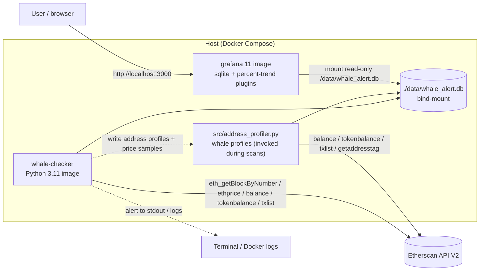
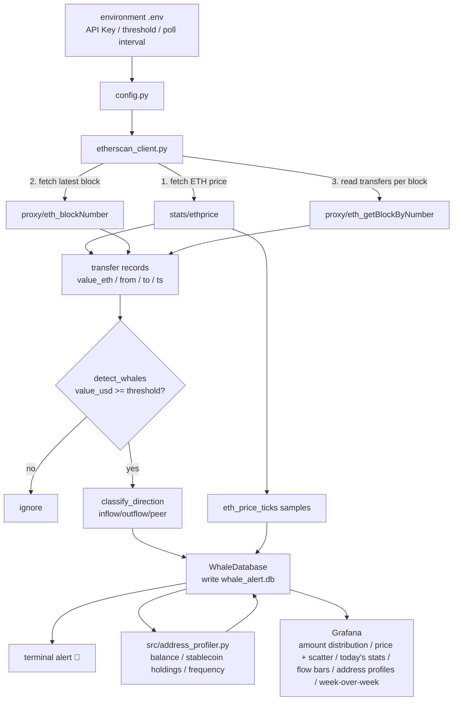

# 🐋 On-chain Whale Behaviour Alert System

[中文](README.md) | [English](README_en.md)

Near-real-time (scheduled polling) monitoring of large ETH transfers on Ethereum mainnet. When a transfer's USD value exceeds the threshold, the system writes that "whale transaction" into SQLite and prints an alert to the terminal; at the same time **Docker Compose** orchestrates Grafana with a pre-built dashboard that visualises whale activity from the last 24 hours.

- **Data source**: Etherscan API V2 (free tier, reads in-block ETH transfers via `proxy/eth_getBlockByNumber`)
- **Threshold**: `WHALE_THRESHOLD_USD` (default `500000`, i.e. $500K — lowered from the initial $10M to capture more whales) — read from `environment .env`
- **Storage**: SQLite (`data/whale_alert.db`, tables `whale_transfers` / `address_profiles` / `eth_price_ticks`)
- **Visualisation**: Grafana 11 + `frser-sqlite-datasource` + `nikosc-percenttrend-panel`, auto-loaded via provisioning
- [**Online public static snapshot (view without running locally)**](http://localhost:3000/dashboard/snapshot/GXcEjoseCUqtEZMv4TkGAxQ9YhwHnFeO)
- [**Online public live dashboard (view without running locally)**](https://snapshots.raintank.io/dashboard/snapshot/YWCQi1i0cFvSQ2rOdIJi7lhtT9eR4oGC)

> 💡 **For the incremental accumulation and data-asset design, see the `feature/incremental-pipeline` branch.**

---

## ✨ Key Features

| Module | Description |
| --- | --- |
| `whale_alert.py` | Main entry point: polls Etherscan, detects whales, writes to the DB and prints alerts |
| `etherscan_client.py` | Etherscan V2 client + pure functions `detect_whales` / `classify_direction` |
| `database.py` | SQLite schema / deduplicated writes / address profiles & price samples (WAL mode) |
| `backfill.py` | Historical backfill tool: **automatic startblock/endblock pagination** (offset=1000/page) + address profiling |
| `src/address_profiler.py` | Whale address profiles: balance / USDT-USDC-DAI holdings / transaction frequency / contract detection, etc. |
| `Dockerfile` / `docker-compose.yml` | Python checker + Grafana orchestration |
| `grafana/` | Provisioning: SQLite data source + base dashboard template |
| `tests/` | pytest unit tests covering `detect_whales` |

> ⚡ **This optimisation pass (v2)**: ① default threshold lowered to `$500,000`; ② `backfill.py` now supports `startblock/endblock + offset` automatic pagination;
> ③ new `src/address_profiler.py` whale address profiling (ETH balance / USDT-USDC-DAI holdings / tx frequency / contract detection / recent activity, etc.) written to the `address_profiles` table;
> ④ new `eth_price_ticks` price-sample table; ⑤ the Grafana dashboard was expanded to 8 panels (price + scatter, today's stats, flow bar chart, address profiles, week-over-week). See [docs/development-log.md](docs/development-log.md).

---

## 🏗️ Architecture



---

## 🔄 Data Flow



---

## 📦 Environment Setup

The project uses the conda environment `whale_alert_project` (Python 3.11, already created).

```bash
# 1) Create and activate the environment (required for every command)
conda create -n whale_alert_project python=3.11
conda activate whale_alert_project

# 2) Install dependencies (run from the project root)
cd whale-alert-system        # or: cd /path/to/whale-alert-system
pip install -r requirements.txt

# 3) Install Docker and Grafana services
```

### Configuration file `environment .env`

Put the real values into `environment .env` in the project root (already ignored by `.gitignore`, not committed):

```ini
ETHERSCAN_API_KEY=your_etherscan_v2_api_key
WHALE_THRESHOLD_USD=500000
POLL_INTERVAL_SECONDS=60
SCAN_BLOCK_WINDOW=20
CHAIN_ID=1
```

- `ETHERSCAN_API_KEY`: create one at [etherscan.io](https://etherscan.io/apis).
- `WHALE_THRESHOLD_USD`: whale detection threshold (USD), **default 500,000** (fallback in `config.py`; if explicitly set in `environment .env` that value wins).
- `SCAN_BLOCK_WINDOW`: number of newest blocks scanned per poll (each block = one API request, limited by the free tier; default 20).

> See the template in [`.env.example`](./.env.example).

---

## 🚀 Running

### Option 1: Run locally

```bash
# Single scan (for tests / cron jobs)
python whale_alert.py --once

# Continuous polling (every 60s by default)
python whale_alert.py

# Historical backfill (automatic pagination: startblock..endblock, offset=1000 blocks/page)
python backfill.py --blocks 1500 --offset 1000

# Backfill only, no address profiling
python backfill.py --blocks 1000 --no-profile

# Whale address profiling (standalone, or triggered automatically by scan/backfill)
python -m src.address_profiler            # incremental profiling
python -m src.address_profiler --force    # full re-profiling
```

### Option 2: Docker Compose (recommended)

```bash
git clone <repo>
cd whale-alert-system        # or: cd /path/to/whale-alert-system

# Build and start the containers; the container automatically backfills + polls
docker compose up -d --build

# Follow the whale alert logs
docker compose logs -f whale-checker
```

Once running, open Grafana at **http://localhost:3000**

- Login: default `admin` / `admin`
- The data source and dashboard are auto-loaded via provisioning — no manual configuration required.
- **Works out of the box (fully automatic)**: on first boot `docker-entrypoint.sh` seeds the live database from the committed snapshot (`seed/whale_alert.db`), so you **see a populated dashboard immediately even before configuring an API key**. It then automatically backfills the newest **2000 blocks** (`BOOTSTRAP_BLOCKS`; re-run with `FORCE_BACKFILL=1`) and enters continuous polling. For live, continuously-updating data, just provide `ETHERSCAN_API_KEY` in `environment .env`.

> **Plugin note**: the "Percentage Trend" panel from the requirements uses the official community plugin (Grafana Labs); its installable id is
> `nikosc-percenttrend-panel` (`grafana-percentage-trend-panel` is the display name, not the actual plugin id).
> `docker-compose.yml` sets both `GF_INSTALL_PLUGINS` (runtime install) and `GF_PLUGINS_PREINSTALL`.

---

## 🕵️ Expected Output

Example terminal alert:

```applescript
====================================================================
  🐋  3 whale transactions triggered (threshold ≥ $10,000,000 USD)
====================================================================
  [exchange_inflow] 4,850.00 ETH ≈ $13,012,000.00 USD
    from: 0xabc...
    to:   0x28c6c0...  (Binance)
    hash: 0x7f...
====================================================================
```

The Grafana dashboard (`whale-overview`) has 8 panels:

1. **Whale transfer amount distribution over the last 24 hours** (hourly bar chart, USD)
2. **Exchange flow share** (pie chart: inflow / outflow / peer-to-peer)
3. **Whale activity timeline** (detail table)
4. **ETH price curve + whale amount scatter** (Timeseries, log axis; price from `eth_price_ticks` samples)
5. **Today's whale transaction stats** (Stat: count / total / largest)
6. **Amount distribution by exchange flow** (Bar Chart)
7. **Whale address profiles** (Table: balance / stablecoins / tx frequency / contract detection / ETH exposure)
8. **This week vs last week whale amount (week-over-week)** (Percentage Trend)

---

## ⏱️ On "real-time" and data coverage

This system uses a **near-real-time polling architecture (scheduled polling)** rather than true streaming; the poll interval is controlled by `POLL_INTERVAL_SECONDS` in `.env`. It continuously pulls the latest block data from Etherscan at a configurable interval and writes it into SQLite for Grafana. **It is not true streaming real-time** (e.g. a WebSocket `newHeads` subscription), because the free Etherscan API does not offer WebSocket push; shortening the poll interval to 10–15 seconds gets you close to real-time monitoring. This approach was chosen because of the free Etherscan API limits — subscribing to `newHeads` via Alchemy or Infura WebSockets requires a paid node.

The current database covers roughly the **last 7,200 blocks (~24 hours)** of on-chain data. The backfill range can be adjusted with `backfill.py --blocks N`; for a longer window, use the `startblock` and `endblock` parameters as needed and keep in mind the free Etherscan API daily limit (100,000 calls/day). To cover a longer period, simply change the block range in `backfill.py`, e.g. `--blocks 10000` covers about 33 hours.

---

## 🧪 Tests

```bash
conda activate whale_alert_project
python -m pytest -q
```

Covers `detect_whales` threshold checks, boundary values, direction classification and that inputs are not mutated.

---

## 📁 Directory Structure

```
.
├── whale_alert.py            # main entry point (polling + alerts)
├── etherscan_client.py       # Etherscan V2 client + detect_whales
├── database.py               # SQLite storage
├── config.py                 # config loading (reads environment .env)
├── backfill.py               # historical backfill (auto-pagination, offset=1000/page)
├── src/address_profiler.py   # whale address profiling (balance/stablecoins/frequency/contract)
├── src/__init__.py
├── requirements.txt
├── Dockerfile
├── docker-compose.yml
├── .env.example              # environment variable template (real values in environment .env)
├── environment .env          # real keys/threshold (gitignored, not committed)
├── data/whale_alert.db       # SQLite database (generated at runtime)
├── grafana/
│   ├── provisioning/
│   │   ├── datasources/whale_datastore.yaml
│   │   └── dashboards/whale_dashboards.yaml
│   └── dashboards/whale_dashboard.json
├── tests/test_whale_alert.py
└── docs/development-log.md   # development log + dashboard insights
```

---

## ⚠️ Notes

- **Free API quota**: the Etherscan free tier is ~5 requests/sec, 100,000 requests/day. Each poll consumes `SCAN_BLOCK_WINDOW` requests, so budget accordingly before running long, high-frequency polling.
- **Internal transactions (contract-to-contract transfers)**: this project reads externally-visible VALUE transfers via `eth_getBlockByNumber`, covering mainly "native ETH transfers". To track contract-internal ETH movement, upgrade to Etherscan API Pro (`txlistinternal`).
- **Exchange address list**: a limited built-in set (Binance/Coinbase/Kraken) is used for flow classification; extend `EXCHANGE_ADDRESSES` as needed.
- **Timezone**: the dashboard uses the browser timezone; the DB stores unix timestamps.

---

## 📄 Documentation

- [Development log + data insights](docs/development-log.md)
